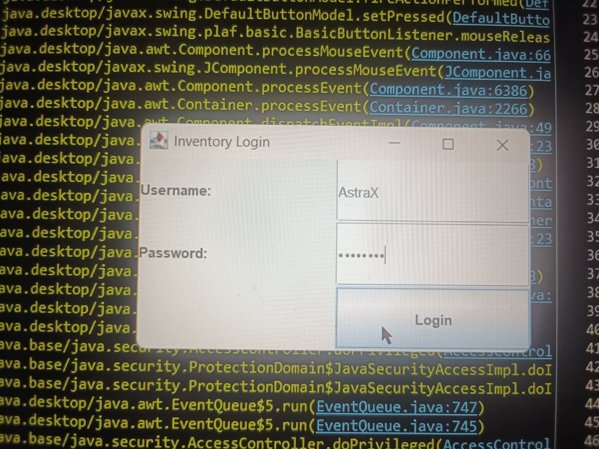
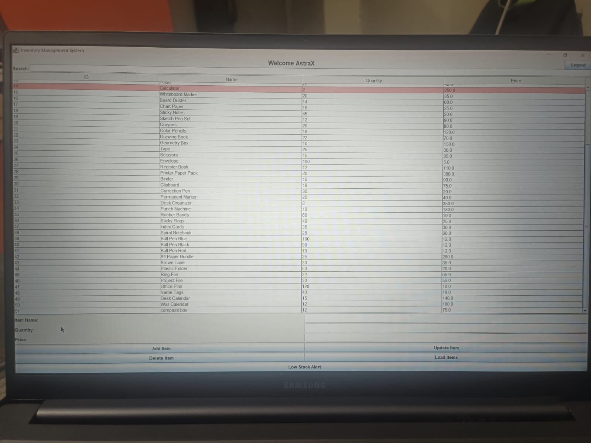
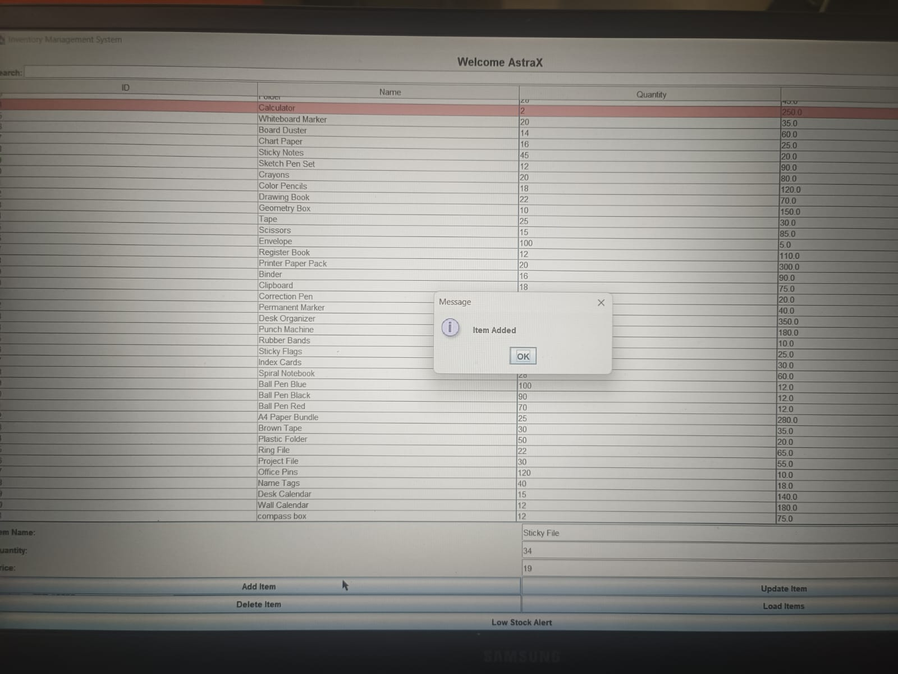
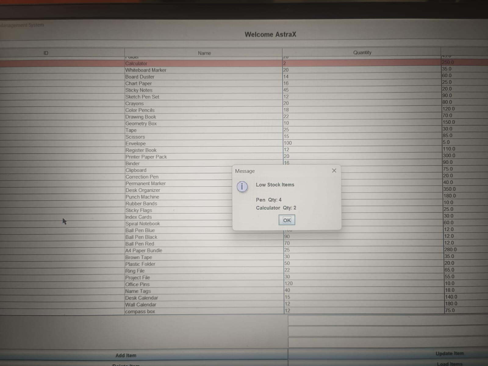

# Inventory Management System

A desktop-based **Inventory Management System** built using **Java Swing and MySQL**.  
This application allows users to manage product inventory efficiently with features like adding, updating, deleting items and monitoring low stock.

---

## Features

- Secure User Login System
- Add New Inventory Items
- Update Existing Inventory Items
- Delete Inventory Items
- Inventory Table Display using JTable
- Low Stock Alert System
- MySQL Database Integration

---

## Technologies Used

- Java
- Java Swing (GUI)
- MySQL
- JDBC
- Eclipse IDE

---

## Project Structure

inventory-management-system  
│  
├── src  
│   ├── gui  
│   │   ├── LoginGUI.java  
│   │   └── InventoryGUI.java  
│   │  
│   ├── db  
│   │   └── DBConnection.java  
│   │  
│   └── main  
│       └── TestConnection.java  
│  
└── inventory_db.sql  

---

## Database Setup

1. Open MySQL Workbench  
2. Create a database  
3. Import the file **inventory_db.sql**  
4. Run the project in Eclipse  

---

## Author

Shivkumar Rathod

## Screenshots

### Login Screen

### Inventory Dashboard

### Add Item

### Low Stock Alert

